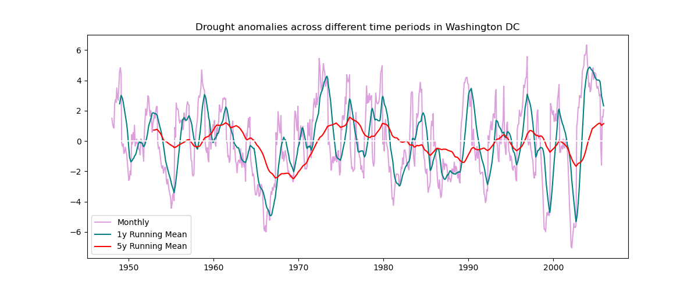

# AIN'T GONNA RAIN NO MORE
## Relationships between the Palmer Drought Severity Index and Soil Moisture
Final Project for CLIM 680: Climate Data  
Aaron Pratt developed this site  
Fall 2024

# Introduction
Water is vital to human systems, including agricultural production. Drought is a period of drier than normal conditions, or limited water. Soil moisture, or water available for plants to use in their growth, is critical for crop production. Understanding spatial relationships of drought periods and soil moisture available for crop growth can assist in planning agricultural production.

# Data

## Drought: 

***Palmer Drought Severity Index:*** identifies relative wet or dry conditions based on temperature, precipitation, and soil-water holding capacity

Source: https://psl.noaa.gov/data/gridded/data.pdsi.html

Spatial Resolution: 2.5 degrees

Temporal Resolution: Monthly

Variable of Interest: Palmer Drought Severity Index

Timespan: January 1870 to December 2005

## Soil Moisture

***Climate Prediction Center Soil Moisture V2:*** models soil moisture based on monthly precipitation and temperature

Source: https://psl.noaa.gov/data/gridded/data.cpcsoil.html

Spatial Resolution: 0.5 degrees

Temporal Resolution: Monthly

Variable of Interest: Soil Moisture in millimeters

Timespan: January 1948 to October 2024

# Code Description

# Results

# Summary
