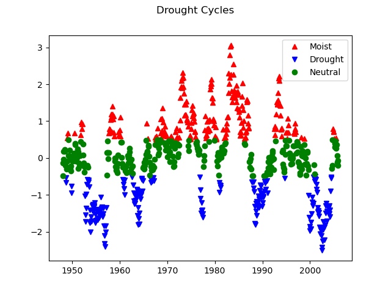

# AIN'T GONNA RAIN NO MORE
## Relationships between the Palmer Drought Severity Index and Soil Moisture  
Final Project for CLIM 680: Climate Data  
Aaron Pratt developed this site in Fall 2024  

# Introduction  
Water is vital to human systems, including agricultural production. Drought is a period of drier than normal conditions, or limited water. Soil moisture, or water available for plants to use in their growth, is critical for crop production. Understanding spatial relationships of drought periods and soil moisture available for crop growth can assist in planning agricultural production.  

# Data  

## Drought: 

***Palmer Drought Severity Index:*** identifies relative wet or dry conditions based on temperature, precipitation, and soil-water holding capacity  

Source: https://psl.noaa.gov/data/gridded/data.pdsi.html  

Spatial Resolution: 2.5 degrees  

Temporal Resolution: Monthly  

Variable of Interest: Palmer Drought Severity Index  

Timespan: January 1870 to December 2005  

## Soil Moisture:  

***Climate Prediction Center Soil Moisture V2:*** models soil moisture based on monthly precipitation and temperature  

Source: https://psl.noaa.gov/data/gridded/data.cpcsoil.html  

Spatial Resolution: 0.5 degrees  

Temporal Resolution: Monthly

Variable of Interest: Soil Moisture in millimeters  

Timespan: January 1948 to October 2024  

# Code Description  

# Results  

I began with exploration of the drought climatology and anomalies at a point in Washington, DC. We observe in this chart periods of relative moisture and drought that can span several months. The signal of periods of relative moisture and drought persist even across a year or 5 year running averages. The intensity of the relative moisture can vary, though the averages decrease the intensity relative to monthly patterns.  
  
***Figure 1: Drought Anomaly in Washington DC***  

I brought in the soil moisture anomaly data at that same point to begin to review the relationship between drought and soil moisture. The signals have a lot of noise, though the chart illustrates some periods that could indicate a relationship between the two.  
  
***Figure 2: Soil Moisture and Drought Anomaly in Washington DC***  

I classified periods of drought, moist, and neutral water regime to run tests for statistically signficant relationships between drought and soil moisture across the United States. I set the threshold at -0.5 for drought and 0.5 for moist periods so that I would find a roughly even counts in each type. I qualitatively observe periods of relative drought clustered in five time periods and moisture clustered in eight time periods.  
  
***Figure 3: Periods of relative drought, moisture, and neutral water regime, based on an index threshold of 0.5.***  

Using those classified drought cycles, I created a composite map of soil moisture and mapped areas of significant difference from neutral for a given cycle to a p-value of 0.05. Areas of significance dominate the map with relatively small areas not showing a significant relationship between the drought or moist period and the soil moisture anomaly relative to neutral period.  
  
***Figure 4: Significant Soil Moisture Anomaly Differences in On Minus Off Palmer Drought Severity Cycle (p-value <0.05)***  

In exploring the drought cycle and soil moisture relationship further, I created a map of correlation with areas of significant correlation to a p-value of 0.005. I chose that p-value because the composite map had shown so much area of significant anomaly difference relative to neutral. The correlation map showed a similar broad extent of significance, with a strong positive correlation covering the United States.
  
***Figure 5: Correlation between Palmer Drought Severity Index and Soil Moisture Anomalies (p-value <0.005)***  

To better understand the degree of the relationship between drought cycle and soil moisture, I created a map of the slope of the linear regression with areas of significance shown to a p-value of 0.001. While the linear regression map showed a consistently broad extent of significance, the slope showed qualitative regional variation in the slope.  
  
***Figure 6: Regression between Palmer Drought Severity Index and Soil Moisture Anomalies (p-value <0.001)***  

# Summary  

My analysis shows a significant positive relationship between drought and soil moisture across most of the United States. This relationship appears strongest in the Corn Belt and patches of the Intermountain West, Pacific Southwest and Mississippi Alluvial Valley. This relationship appears positive, but not always significant in the Pacific Northwest and in patches along the east coast including Florida and New England. In the Caribbean, the relationship appears negative at some locations.

This analysis also introdued me to data access fragility. I was not able to access the data during a period following Hurricane Helene's disruption at the National Center for Environmental Information. This experience emphasized the importance of redundant and local storage as a resliency measure.

My next steps would include:

- Increasing understanding of the precipitation and temperature datasets underlying the soil moisture and drought models  
- Exploring alternative datasets for drought and soil moisture to support these findings
- Conducting the composite analysis across multiple thresholds for drought cycles  
- Examining the regions identified for finer scale understanding of variation in the relationship  
